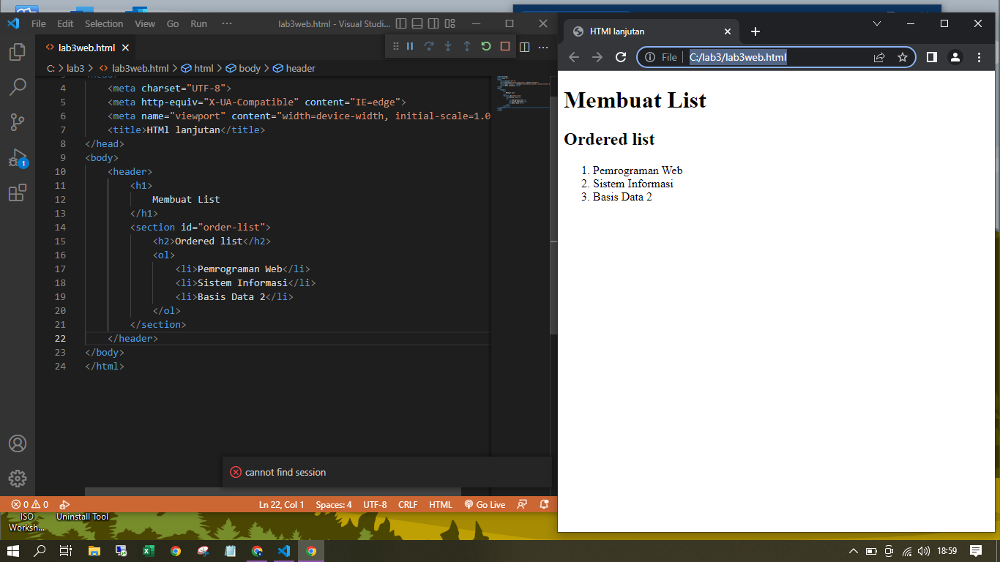
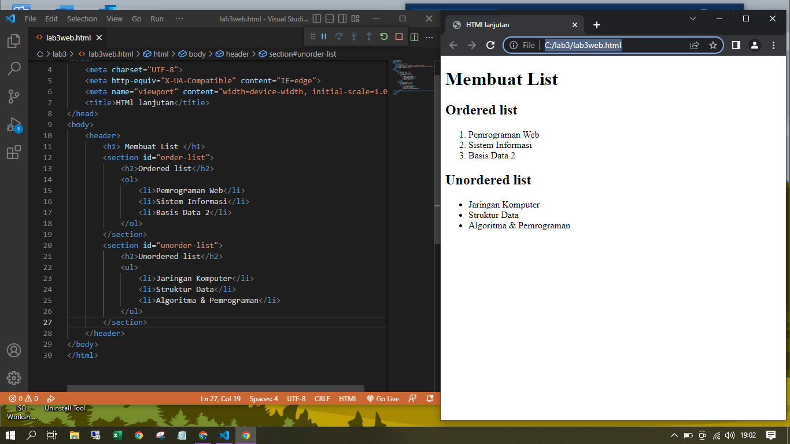
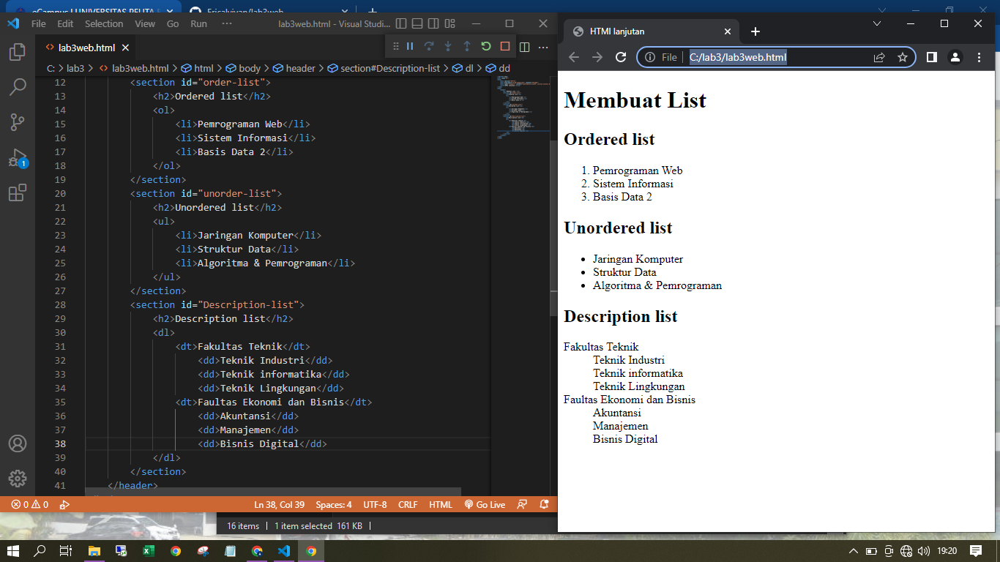
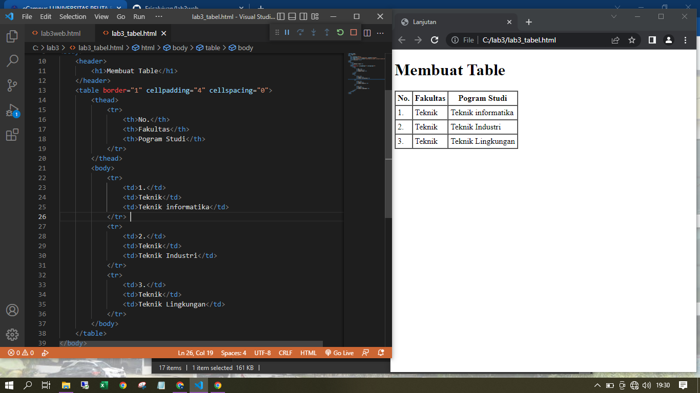
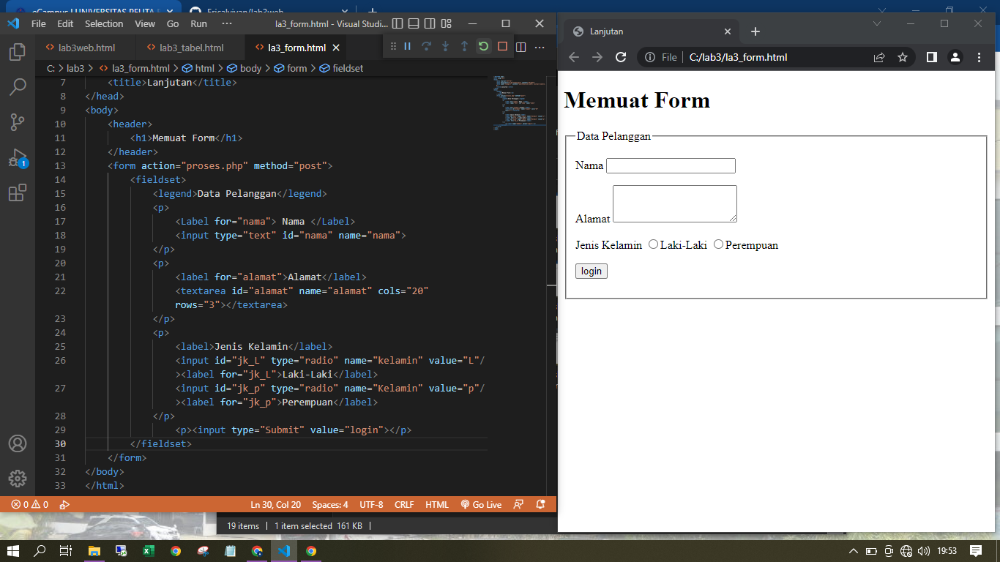
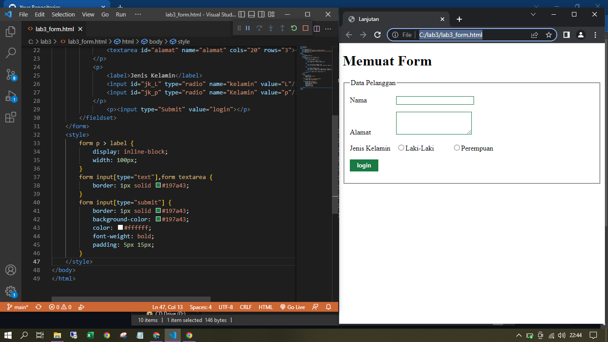

# lab3web
## belajar dasar membuat Order list, Unorder list, Description list, Tabel dan Form

### membuat order list
ini adalah tampilan nya

#### membuat unorder list
deklarasi ordered list pada section

##### membuat description list
ini adalah tampilan nya

###### membuat tabel
mengatur margin dan padding pada tabel

menggabungkan sel data

###### membuat form
ini adalah tampilan nya

###### menambahkan stye pada form
menambahkan style pada form, ini tampilan nya

